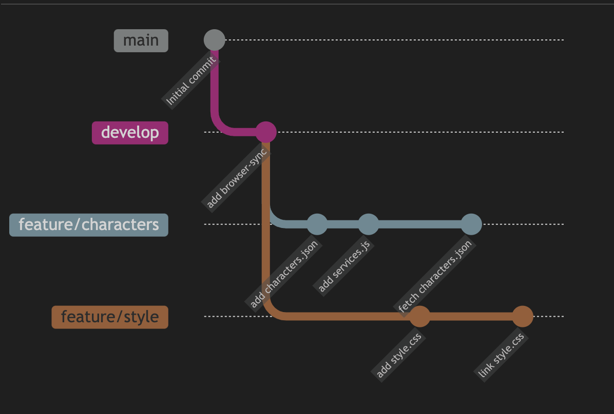
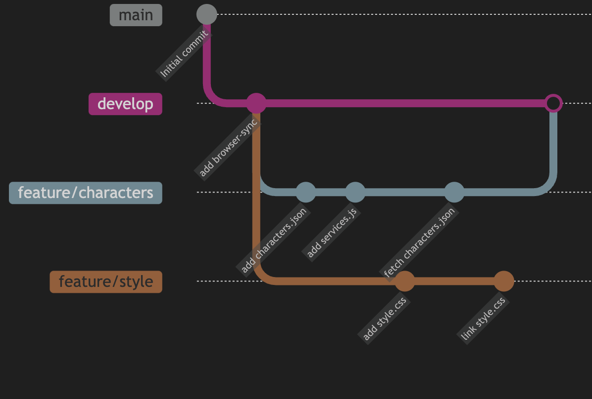
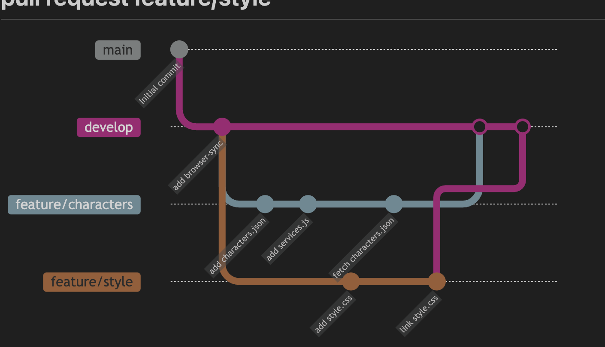
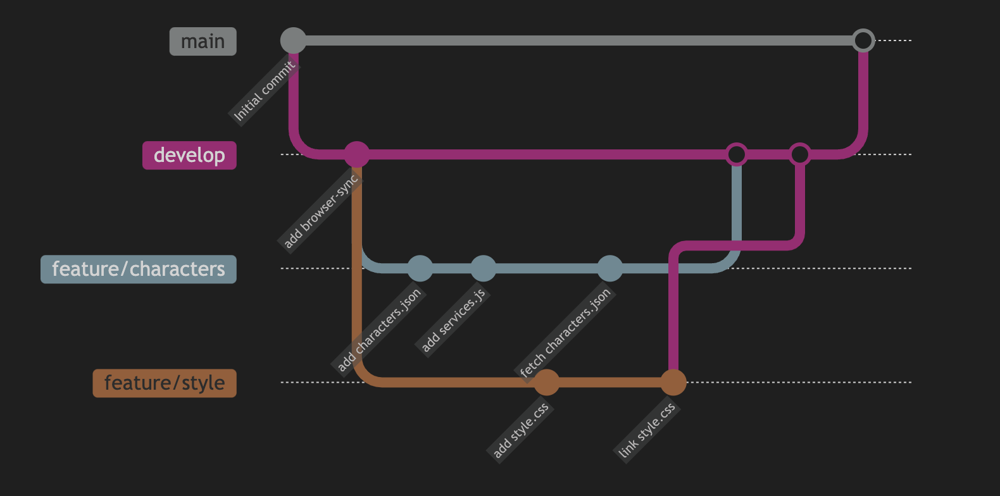

# Marvel App

- Outiller le projet afin de pouvoir utiliser le live reload
    - Utilisation de `browser-sync`

- Deux demandes d'évolutions à traiter en parallèle :
  - Récupérer la liste des personnages depuis une API
    - dans un premier temps, récupérer la liste des personnages depuis un fichier JSON ( nous ferons l'appel à l'API dans un second temps )
  - Modifier le style de l'application

---

# Outiller le projet

- Créer une branche `develop` depuis la branche `main`
- Configurer `browser-sync` dans le fichier `package.json` et `bs-config.js`
- Vérifier que le live reload fonctionne
- Commiter les modifications

---

# Récupération des données

- Créer une branche `feature/characters` depuis la branche `develop`
- Créer un fichier `characters.json` dans le dossier `data`
- Créer un fichier `services.js` dans le dossier `src`
- Utiliser `fetch` pour récupérer les données du fichier `characters.json`
- Afficher la response dans la console
- Transformer la response en JSON
- Afficher la response dans la console

---

# Récupération des données

- Parcourir la liste des personnages
- Afficher le nom de chaque personnage dans la console
- Créer une liste `ul` en javascript juste après le titre `h1`
- Ajouter un élément `li` dans la liste `ul` pour chaque personnage
- Afficher le nom de chaque personnage dans la liste

---

# Récupération des données

- Ajouter un élément `h2` après la liste `ul`
- Le contenu de cet élément sera le nombre de personnages, par exemple : `Number of characters : 20`, ce nombre doit être dynamique

---

# Modification du style

- Créer une branche `feature/style` depuis la branche `develop`
- Créer un fichier `style.css` dans le dossier `src`
- Importer le fichier `style.css` dans le fichier `index.js`
- Modifier le style de l'application

---

# Etat actuel

---
# Fusion des branches

- Nous avons deux branches qui contiennent chacune une demande d'évolution
- Nous allons fusionner ces deux branches dans la branche `develop` grâce à des Pull Request
---

# Pourquoi des Pull Request ?

- Permet de vérifier le code avant de le merger dans la branche `develop`
- Permet de discuter du code, de demander des modifications, etc.
- Permet de vérifier que le code est conforme aux règles de développement de l'entreprise
  - Qualité du code
  - Tests unitaires
  - Dépendances, licences, etc.

---
# pull request feature/characters

---

# pull request feature/style

--- 

# pull request de la branche `develop` vers la branche `main`

Nous avons maintenant une première version de notre application (trés basique), mais fonctionnelle.

Nous allons donc merger la branche `develop` dans la branche `main` afin d'avoir une version de notre application qui fonctionne.

---

# pull request de la branche `develop` vers la branche `main`

---
# Ce qui a été vu

- Nous avons vu comment outiller un projet afin de pouvoir utiliser le live reload
- Nous avons vu comment récupérer des données depuis un fichier JSON
- Nous avons vu comment modifier le style d'une application
- Nous avons vu comment gérer les branches avec Git

---

# Constat

- Nous mélangeons le code HTML et le code Javascript
- Nous mélangeons traitement des données et affichage des données
- Le code sera difficilement maintenable lors de l'ajout de nouvelles fonctionnalités

---

# Prochaine étape

- Nous allons utiliser une librairie Javascript qui nous permettra de séparer le code HTML du code Javascript et de séparer le traitement des données de l'affichage des données
- La librairie Javascript que nous allons utiliser est `React`

---

