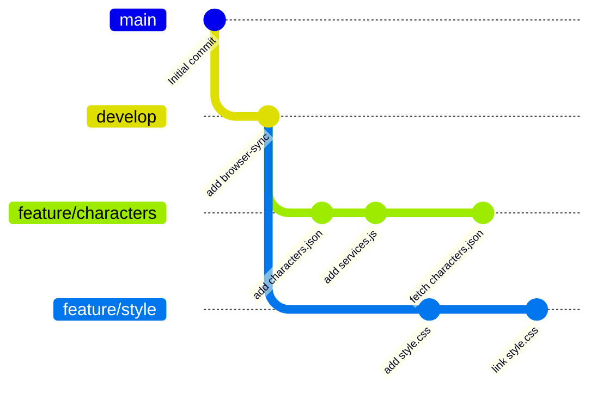
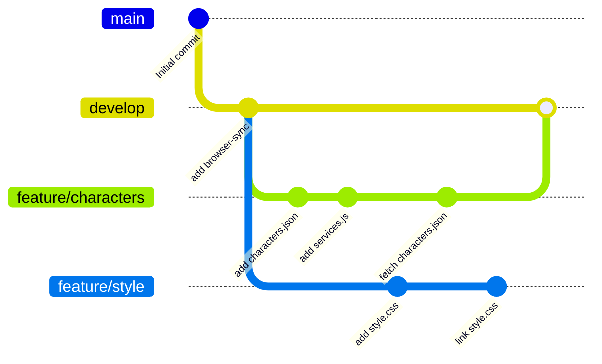
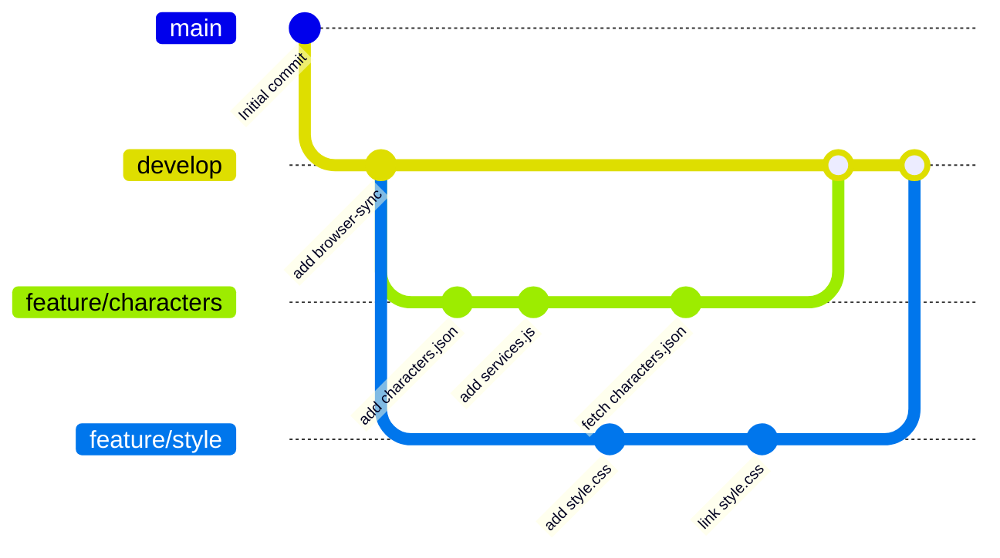
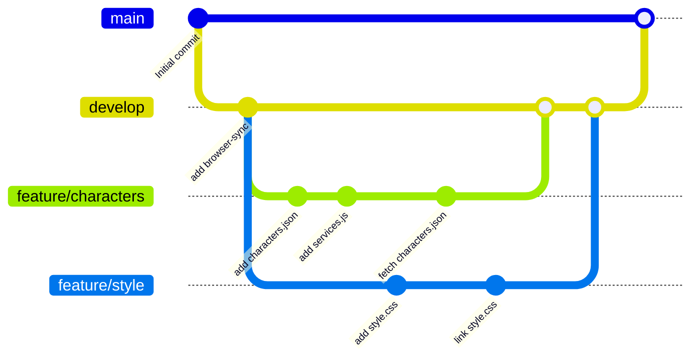

# Etat actuel

```mermaid

gitGraph
   commit id: "Initial commit"
   branch develop
   commit id: "add browser-sync"
   branch feature/characters
   commit id: "add characters.json"
   commit id: "add services.js"
   checkout develop
   branch feature/style
   commit id: "add style.css"
   checkout feature/characters
   commit id: "fetch characters.json"
   checkout feature/style
   commit id: "link style.css"
```

## pull request feature/characters

```mermaid

gitGraph
   commit id: "Initial commit"
   branch develop
   commit id: "add browser-sync"
   branch feature/characters
   commit id: "add characters.json"
   commit id: "add services.js"
   checkout develop
   branch feature/style
   commit id: "add style.css"
   checkout feature/characters
   commit id: "fetch characters.json"
   checkout feature/style
   commit id: "link style.css"
   checkout develop
   merge feature/characters
   
```

# pull request feature/style

```mermaid

gitGraph
   commit id: "Initial commit"
   branch develop
   commit id: "add browser-sync"
   branch feature/characters
   commit id: "add characters.json"
   commit id: "add services.js"
   checkout develop
   branch feature/style
   commit id: "add style.css"
   checkout feature/characters
   commit id: "fetch characters.json"
   checkout feature/style
   commit id: "link style.css"
   checkout develop
   merge feature/characters
   merge feature/style
   
```

# pull request develop -> main

```mermaid

gitGraph
   commit id: "Initial commit"
   branch develop
   commit id: "add browser-sync"
   branch feature/characters
   commit id: "add characters.json"
   commit id: "add services.js"
   checkout develop
   branch feature/style
   commit id: "add style.css"
   checkout feature/characters
   commit id: "fetch characters.json"
   checkout feature/style
   commit id: "link style.css"
   checkout develop
   merge feature/characters
   merge feature/style
   checkout main
   merge develop
```